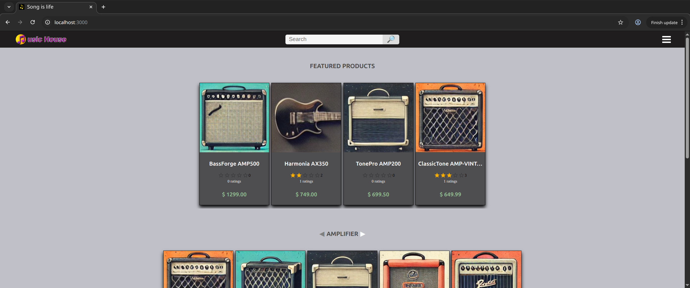
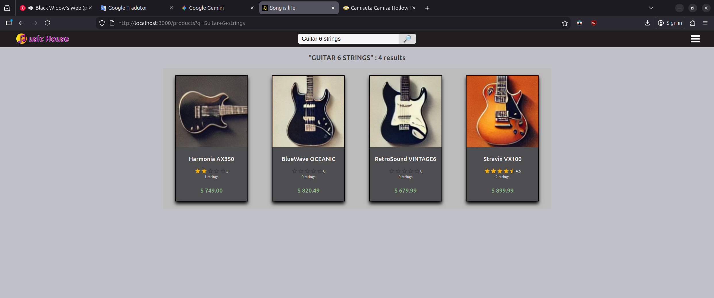
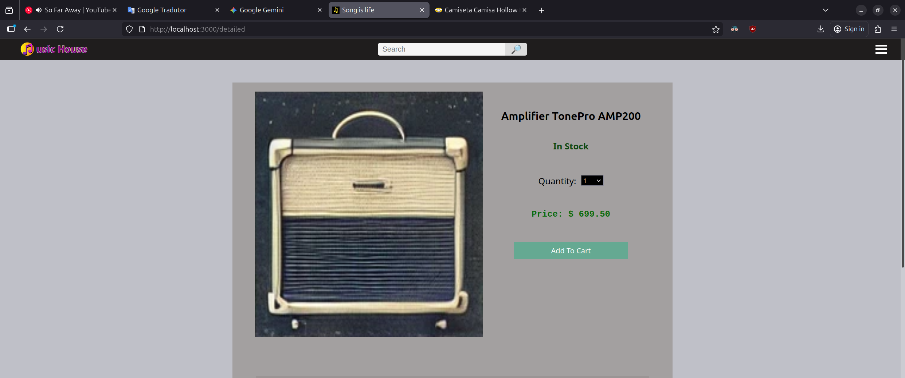

### Description:

E-commerce of musical instruments using a microservices architecture

### System features:

- Full text search
- Shopping cart
- Purchase and payment
- Asynchronous payment verification via messaging
- Asynchronous inventory controll via messaging that is updated when a sale occurs

### Screenshoots:

### Technologies/Frameworks:

Java, Spring Cloud, RabbitMQ, JPA Specifications, Open Telemetry, Eureka,
React, Open Feign, Docker, MySQL, MongoDB, Junit, MockMVC e Testcontainers

### Instructions for use:

- You need to have docker installed on your machine
- The unique project file needed is the **docker-compose.yml**
- Open the folder where you placed the file in the terminal
- Type `docker compose up` (all services will be downloaded from Docker Hub)
- Wait the services to load, then open the browser and type `localhost:3000` as url
