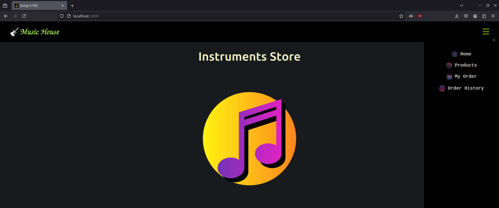
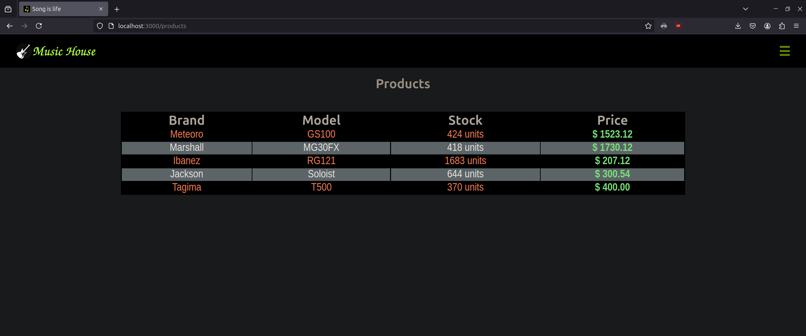
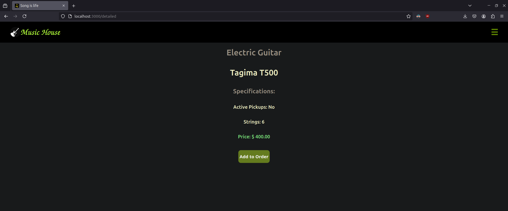
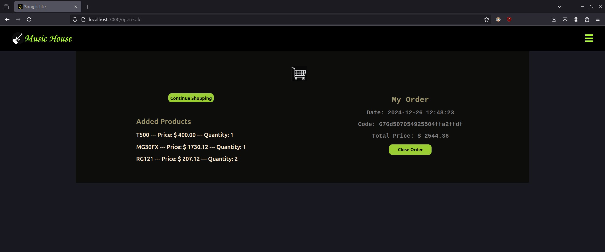
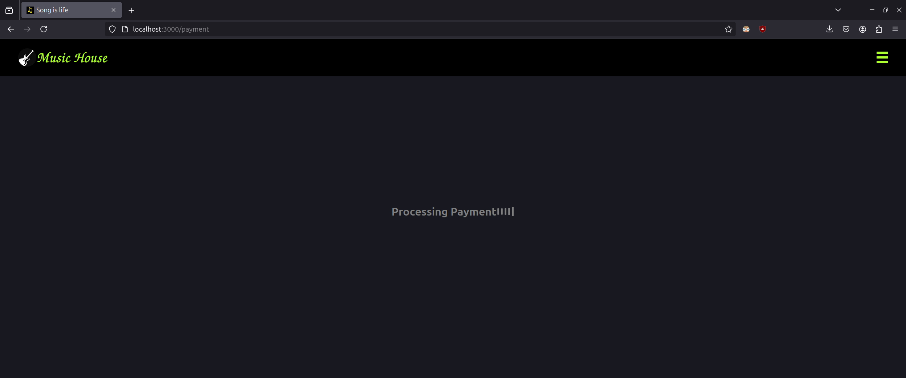
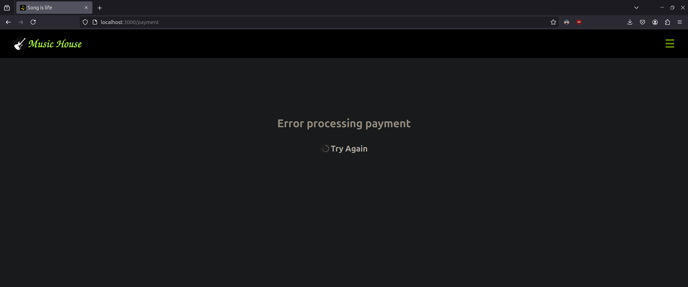
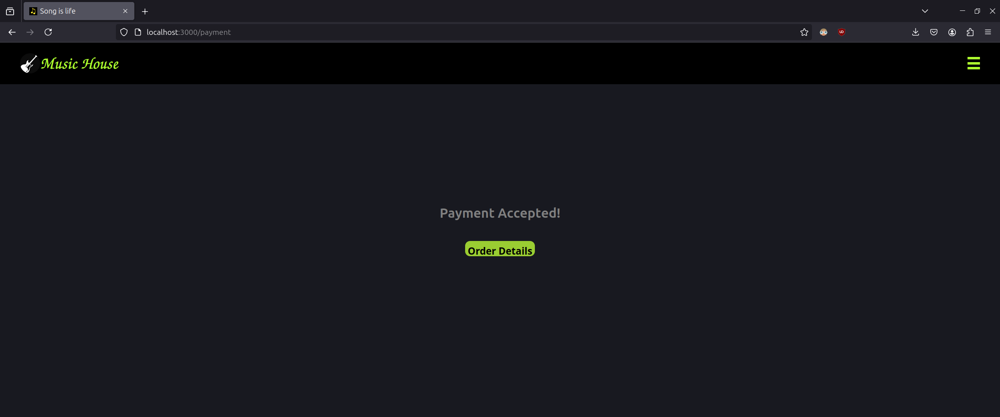
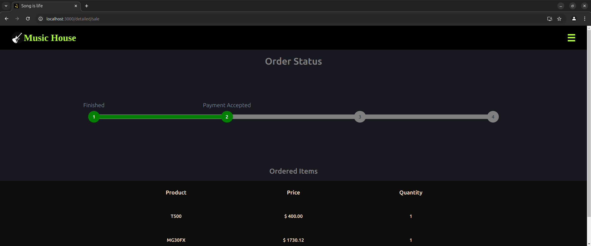
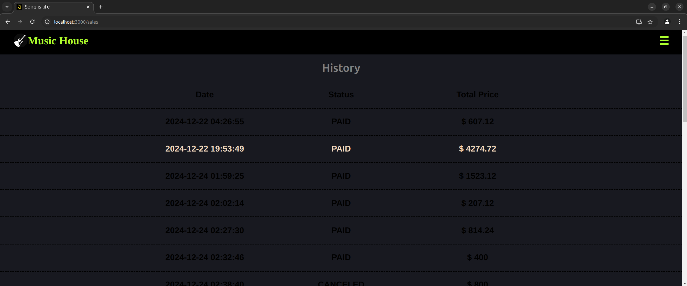
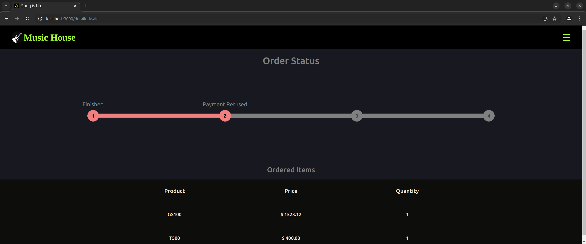

## Application with microservices architecture
### Instructions for running:
	You need to have docker installed on your machine
 	With the musichouse folder open in terminal, type docker compose up
	Open the browser and type localhost:3000
### The app:
	This is an musical instruments web store, where is possible add items to order

	After click in the close order button, 
 	there will be a processing payment simulation and a progress bar to see the order status

 	
  	The order status and the products stock change asynchronously over time via messaging

	At this moment, the status reach only the processing payment result,
 	but will be change until the delivered status in the near future

