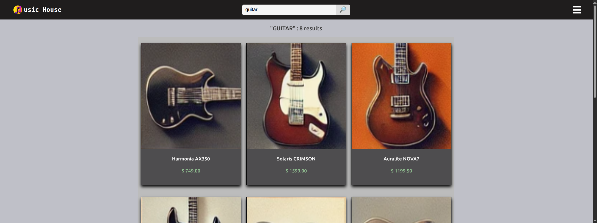
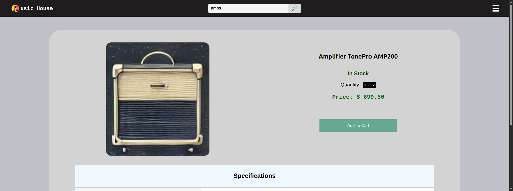

### Description:

Online store for musical instruments with a microservices architecture (product, sales, payment).

There is a gateway service as an access point, more than one instance per service, telemetry to monitor system behavior, and integration tests.

### System features:

- Full Text Search
- Shopping Cart
- Purchase and Payment Simulation
- Asynchronous Payment Verification via Message
- Asynchronous Inventory Controll via Message that is updated according to sales

### Technologies/Frameworks:

Java, Spring Cloud, RabbitMQ, JPA Specifications, Open Telemetry, Eureka,
React, Open Feign, Docker, MySQL, MongoDB, Junit, MockMVC e Testcontainers.

### Instructions for use:

- You need to have docker installed on your machine.
- The unique project file needed is the **docker-compose.yml**
- Open the folder where you placed the file in the terminal
- Type `docker compose up` (all services will be downloaded from Docker Hub)
- Wait the services to load, then open the browser and type `localhost:3000` as url

### Screenshoots:

